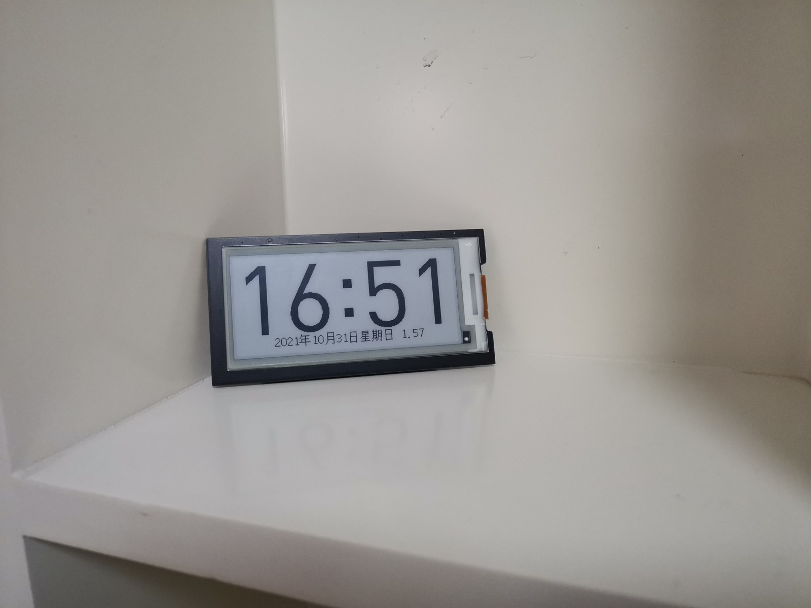

# EPD-CLOCK

## 简介

本项目使用了2.9寸电子价签中的墨水屏，出于个人爱好制作而成，目前仅设计了简单的基础功能，实物效果如下。



经过估算，低功耗状态下的待机电流应该小于20uA，因测量设备不足无法测量故刷新功耗不详，单节电池可用寿命不详。经过简单测试，工作两周，每天工作时间16小时，电池电压从1.57V降至1.47V，仅供参考。

## 源码目录

```
├── fw                  # 固件
│   ├── binloader       #  SPI flash烧录固件，基于flashrom的serprog协议
│   └── clock           #  主固件
└── hw                  # 硬件，原理图、PCB及相关内容
```

## 硬件简介

本项目使用的墨水屏、MCU、SPI flash均来自电子价签，使用单节7号干电池升压供电，详细原理图及元器件信息见`hw`目录，本项目原理图等使用`KiCAD`进行绘制。

## 固件编译

项目中涉及到的两个固件程序均使用CMake进行管理，GCC作为编译器，在Debian 11发行版中进行构建。

## 字库烧录

本项目字库未采用全字库方案，而是只取了部分使用的字体，使用genmatrix([gitee](https://gitee.com/ieiao/genmatrix)|[github](https://github.com/ieiao/genmatrix))工具`xxd_format`分支进行了字符取模，使用`fw/binloader`程序来进行字库烧录。

`binloader`是[flashrom](https://flashrom.org/Flashrom)工具中serprog协议的一种实现，借助串口实现对spi flash内容的读写，虽然速度一般，但足以应对本项目使用的超小体积字库。

成功编译并且将binloader程序烧录到单片机后，使用任意USB转TTL串口连接设备与电脑，此时便可以借助flashrom对SPI flash进行烧录了，烧录文件见`fw/clock/flash/font.bin`。

> 如果不介意烧录速度慢的话可以将字库文件pad一段数据到flash容量大小后进行全片烧录；如果介意烧录速度的话可以使用flashrom的layout特性仅烧录指定的部分，或者使用其他高速烧录器烧录后再进行焊接。

## 主程序说明

主程序目前只实现了时间日期显示及调节、电池电压监测以及简易的夜间模式，基本满足看时间的需求。

